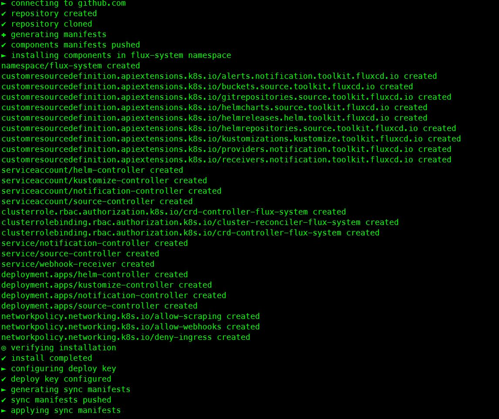
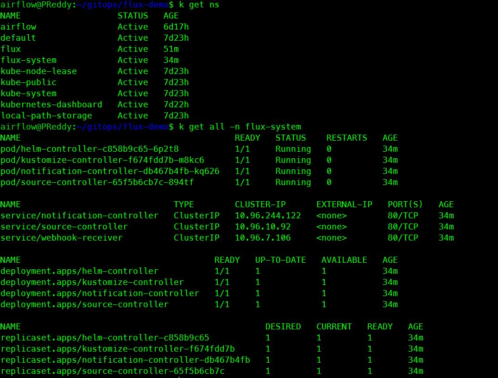
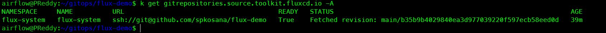
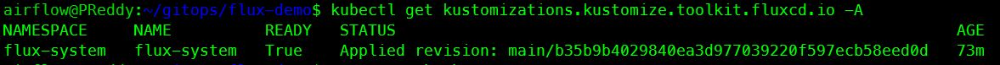

# Disclaimer: I followed the amazing installation guide and below youtube video to try Flux demo and see how it works 
## Installation guide: https://toolkit.fluxcd.io/guides/installation/
## Flux demo Source video 
  - [flux intro: part1](https://www.youtube.com/watch?v=0v5bjysXTL8 "part1")
  - [flux intro: part2](https://www.youtube.com/watch?v=fC2YCxQRUwU "part2")

# Namespace: flux-system

## Summary: Below steps creates a repo and get the cluster synchronized like a charm without using "kubectl apply" 
* If you have [kind](https://kind.sigs.k8s.io/docs/user/quick-start/ "kind") use:  kind create cluster --name flux 
* If you dont have kind: Create a Namespace - kubectl create ns flux 
* Install flux-get-started -- flux documentation
* To start and create a repository in your github magically
  - Create repo cmd: flux bootstrap github --owner=spkosana --repository=flux-demo --private=false --personal=true --path=./cluster/
  - connects to your github account
  - respository will be created
  - repository will be cloned
  - manifests will be generated
  - components manifests will be pushed
  - creates a namespace flux-system
  - components will be installed in above created namespace
* Below custom resource definitions(crd) will be created
  - alerts notification toolkit
  - buckets source toolkit
  - git repositories toolkit
  - helm charts source toolkit
  - helm releases source toolkit
  - kustomization kustomize toolkit
  - providers notification toolkit
  - recievers notification toolkit
* Below service accounts will be created
  - helm-controller
  - kustomize-controller
  - notification-controller
  - source-controller
* Below cluster roles will be created
  - cluster role rbac authorization - crd-controller-flux-system
  - cluster role bindings  
    - cluster-reconciler-flux-system
    - crd-controller-flux-system
* Below service will be created
  - notification-controller
  - source-controller
  - webhook-controller
* Below deployments roles will be created
  - helm-controller
  - kustomize-controller
  - notification-controller
* Below network policies will be created
  - allow-scraping
  - allow-webhooks
  - deny-ingress
* Last steps
  - verifying installation
  - install completed
  - configuring deploy key
  - deploy key configured
  - generating sync manifests
  - sync manifests pushed
  - applying sync manifests
  - waiting for cluster sync
  - bootstrap finished

## Image of above command output
  - 

## Clone above created repository
  - git clone [flux-demo Git](https://github.com/spkosana/flux-demo "flux-demo")

## Namespace and Synchronize cluster verification - I have an alias setup for kubectl as k. 
  - kubectl cmd for checking namespace: kubectl get namespace 
  - kubectl cmd for checking all resources: kubectl get all -n flux-system
  - 

## To view git repository using kubectl(k) - for checking git status i used an alias(fdemo) - I am lazy ;) 
  - kubectl cmd for viewing repository: kubectl get gitrepositories.source.toolkit.fluxcd.io -A
  - You compare your git repository commit id to the id with STATUS field , you will see both match 
  - default behaviour is git sync happens every 10mins and prunes as well
  - 

## Next step is to create a manifest file for deploying applications
  - git push application manifest file: Changes to push to repository
  - As mentioned above use fdemo to check the git repository - commit id will now change. 

## Next step is to check kustomize
  - kubectl cmd Check Kustomize status for git repository: kubectl get kustomizations.kustomize.toolkit.fluxcd.io -A
  - status denotes True for active , False for suspended status - image 1 
  - you can suspend using cmd: flux suspend kustomization flux-system
  - you can resume using cmd: flux resume kustomization flux-system
  - check suspended status - image 2 - Although status is suspended git sync will still work every 10 minutes
  - image 1
  - 

## Check if application deployed is available
  - deployed application status cmd: kubectl get deploy
  - will give you output of your application

## to perform git sync manually
  - manual reconsile cmd: flux reconcile source git -n flux-system flux-system

## Monitoring with prometheus and grafana
  - Use this cmd to setup prometheus and grafana: flux create source git monitoring --interval=30m --url=https://githubcom/fluxcd/flux2 --branch=main
  - Apply manifests/monitoring cmd: flux create kustomization monitoring --interval=1h --prune=true --source=monitoring --path="./manifests/monitoring" --health-check="Deployment/prometheus.flux-system" --health-check="Deployment/grafana.flux-system"

## Access grafana dashboard
  - port forward cmd: kubectl -n flux-system port-forward svc/grafana 3000:3000
  - open url: http://localhost:3000/d/gitops-toolkit-control-plane/gitops-toolkit-control-plane
